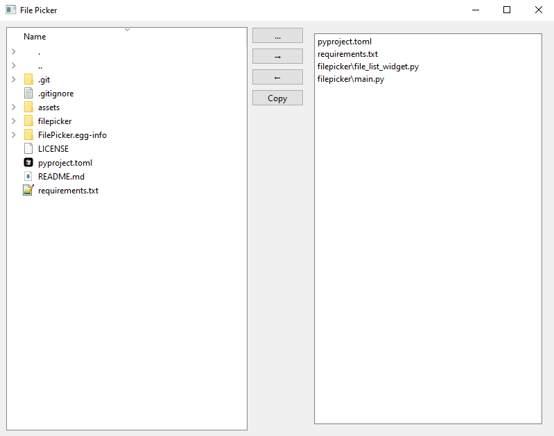

# FilePicker

FilePicker is a utility designed to simplify file selection for code projects. It allows users to pick specific files from a project directory, concatenate their contents, and copy the results to the clipboard. This is particularly useful for providing context to Large Language Models (LLMs) when seeking programming assistance.



## Features

- **File Selection**: Browse directories and select specific files by either double-clicking or using the right-arrow button.
- **File List Management**: Move selected files to a dedicated list and easily remove them with the left-arrow button or by double-clicking them in the list.
- **Clipboard Copying**: Combine the contents of selected files, along with their filenames, and copy to the clipboard for easy pasting.

## Installation

### Prerequisites

- Python 3.8 or higher
- [PyQt6](https://pypi.org/project/PyQt6/) version 6.4.0 or higher

### Installation Steps (Windows, Linux, and Mac)

1. Clone the repository:
   ```bash
   git clone https://github.com/pdavis68/FilePicker.git
   cd FilePicker
   ```


1. Install the application in editable mode using pip:

    ```bash
    pip install -e .
    ```
    This will install FilePicker as a command-line tool, allowing you to run it with the command filepicker.

1. Run the application from the command line:
 
    ```bash
    filepicker
    ```

## Usage

1. Select Directory: Either run it in the directory you want to work from or use the "..." button to select your starting directory.
1. Browse Files: Use the file tree to browse the directory structure. To add a file to the File List, either double-click it or select it and click the right-arrow button.
2. Manage File List: Remove files from the File List by selecting them and clicking the left-arrow button or by double-clicking the file in the list.
3. Copy to Clipboard: When ready, click the Copy button to concatenate file contents along with their filenames and place them in the clipboard for easy pasting.

## Thanks

I'd like to thank the [Aider](https://aider.chat/) team. I'm a C# developer, but I wanted this to be a cross-platform tool. ChatGPT suggested I use PyQt for a cross-platform UI. This would have taken me at least several hours to write on my own, having no PyQt experience and not really being a Python developer, but with Aider, an Anthropic API key and about $0.35, it took about a half hour. It also wrote most of the README above. It's a fantastic tool. Big high-five to those guys!
